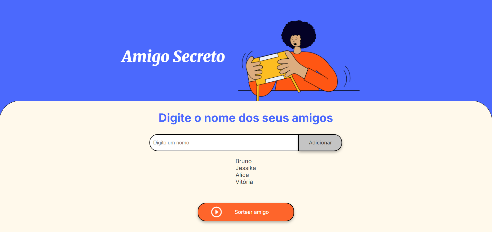
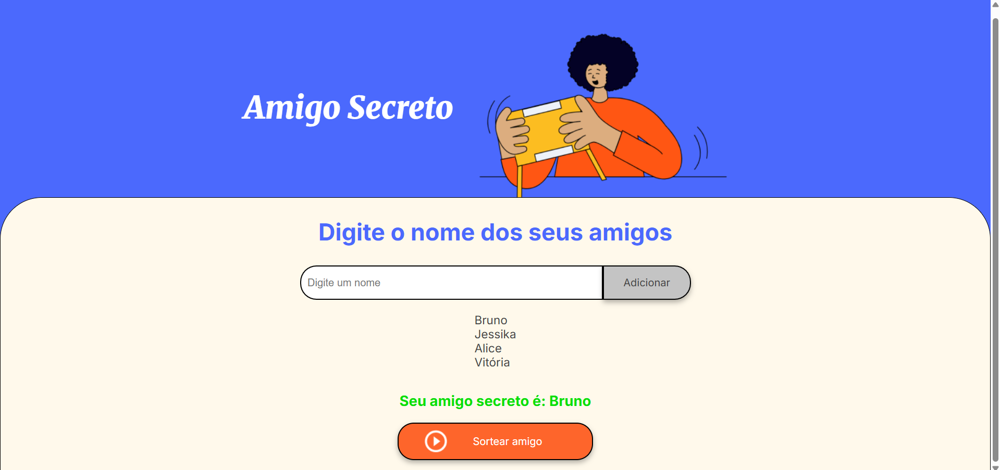
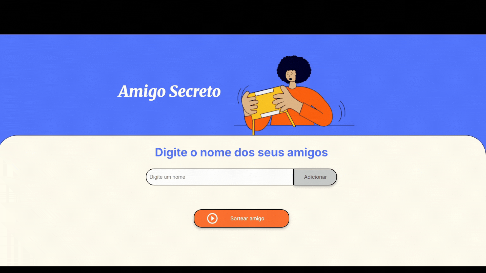

# Amigo Secreto 🎁  

Um aplicativo simples para organizar sorteios de amigo secreto.  

## 📌 Funcionalidades  
- Adicionar nomes dos participantes  
- Realizar o sorteio de forma automática  
- Exibir os pares sorteados  

## 🖼️ Capturas de Tela  
Os prints abaixo mostram o funcionamento do sorteio:  

### Adicionando Nomes ao Sorteio  
  

### Realizando o Sorteio  



## ⚙️ Tecnologias  
🔹 **Linguagens utilizadas:** JavaScript, HTML e CSS  

## 💡 Melhorias Futuras
🔹 Implementação de login para usuários
🔹 Opção para exportar sorteios

## 📄 Licença
Este projeto está sob a licença MIT.

## 🚀 Como Usar  
1. **Clone o repositório:**  
   ```sh
   git clone https://github.com/seu-usuario/amigo-secreto.git
